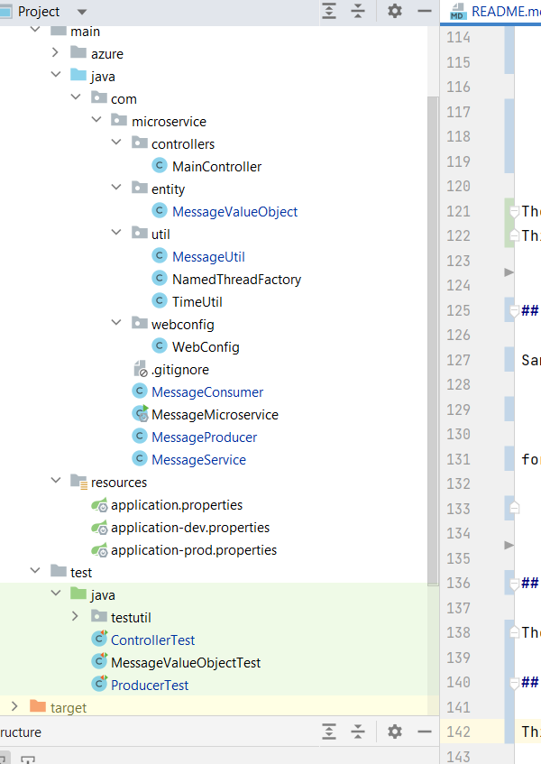

# README #

# Description

This is a simple Proof of Concept (POC) of a Message Processor Simulator:

1) Message Processor Recieves a data file simulating a stream of messages over a network
2) Messages are received one at a time and processed with a single Message Producer
3) Messages are consumed with multiple (user specified) number of Message Consumers
4) The API to process messages is exposed through a path '/interview/process-file/{maxConsumers}'
5) This is a Spring Boot application with only CORE Java libraries used

## MessageProducer and Parsing Input

There is a single MessageProducer tasked with the parsing data file and pumping messages onto Message Processing Pipeline 

### Parsing Input 

Sample Input File Format:

    A|1000|Monday
    B|1000|Wednesday
    D|3000|Friday

To break down the file into individual messages MessageProducer utilizes a java.util.Scanner - A simple text scanner to break
its input into lines and then the resulting lines are converted into the MessageValueObjects with a custom parse message logic. 

Parsing algorithm allows for empty fields, for example when ID and Payload are not present (|200|), it will still create a valid MessageValueObject.  

The resulting Messages are divided into 2 classes:

     *
     * 1) Valid Message
     *
     * If MessageValueObject is present with all values then it is in a valid state and
     * we place it into the message pipeline for further processing
     *
     * 2) Invalid/Poisonous Message
     *
     * If Value Object is missing both ID and Payload then we stop processing for the specified timeout period

## MessageConsumers

There can be as many consumers as we specify in the request - the cosnumers are populated into a Thread Pool and Java's 
ExecutorService is used to manage all aspects of threads operation

### Message Processing Pipeline - Shared Data

The producer and consumers share **Message Processing Pipeline**. The Producer populates it and the consumers process it; 
this pipeline is organized as a Blocking Queuee

        // The main message pipeline where producer outputs the messages and the consumers consume
        //
        BlockingQueue<MessageValueObject> messagePipeline = new LinkedBlockingQueue<MessageValueObject>();

Here is the Producer method to pump data into this pipeline:

        try {

            Scanner scanner = new Scanner( new String( messageFile.getBytes(), StandardCharsets.UTF_8));

            // Process incoming data line by line
            //
            while (scanner.hasNextLine()) {

                String line = scanner.nextLine();

                MessageValueObject message = new MessageValueObject( line );

                if (message.isInvalid()){

                    // is Message is missing an ID then the producing thread will sleep for the specified time
                    //
                    currentThread().sleep( message.getProcessingTime() );
                }
                else {
                    messagePipeline.put(message);
                }
            }

            scanner.close();

And here is the Consumers method to read data from the Pipeline

    private void processMessagePipeline() throws InterruptedException {

        if ( messagePipeline.size() > 0) {

            MessageValueObject message = messagePipeline.take();

            // check if the message can be processed at this time
            //
            if (canBeProcessed(message)) {
                idsBeingProcessed.add(message.getId());
                consumeMessage( message);

            } else {
                processMessagePipeline();
            }
        }
    }

### Data structures used by Consumer

To facilitate processing of the messages in the proper order the consumer threads use two additional queues:

        // Global snapshot of the ids being currently consumed between threads
        //
        List<String> idsBeingProcessed = Collections.synchronizedList( new ArrayList<>());

        // Per consumer thread processing queue (not synchronized)
        //
        List<MessageValueObject> consumerMessageQueue = new ArrayList<>();

These queues are used to keep track of currently processing Id, if the consumption process detects a duplicate ID then it pulls the duplicate message off the main processing queue into a per thread processing queue, effectively staging it for later processing.
This ensures that the messages with duplicate ID's are processed sequentially, in the order recieved

## How to make calls

Sample curl command 

    curl -X POST -F "file=@./testdata/messageData/messages.txt"  127.0.0.1:8080/interview/process-file/{maxConsumers}

for example:

    curl -X POST -F "file=@./testdata/messageData/messages.txt"  127.0.0.1:8080/interview/process-file/5

## Unit Test

The project is extensively tested with JUnit - ControllerTest contains 4 Unit tests with different data files simulating testing scenarios, MessageValueObjectTest and ProducerTest contain tests checking message production and value objects use cases

## Application Organization 

This POC is a SpringBoot Application organized by Layers -  i.e; all controllers are placed in controllers package and services under services package and all entities under domain or model etc.

## Sample Console Output 

ControllerTest.postMessageFileTest produces the following output

`

    2022-08-02 12:23:23.072  INFO 54932 --- [o-auto-1-exec-1] o.a.c.c.C.[Tomcat].[localhost].[/]       : Initializing Spring DispatcherServlet 'dispatcherServlet'
    2022-08-02 12:23:23.073  INFO 54932 --- [o-auto-1-exec-1] o.s.web.servlet.DispatcherServlet        : Initializing Servlet 'dispatcherServlet'
    2022-08-02 12:23:23.073  INFO 54932 --- [o-auto-1-exec-1] o.s.web.servlet.DispatcherServlet        : Completed initialization in 0 ms
    PID: 19;  START: 12:23:23:112;  Consumers:  5;  File: messages.txt
    PID:36;		E|500|e-01;		Thread: MessageConsumer[5];		Start: 12:23:23:118;		End: 12:23:23:633
    PID:34;		D|500|d-01;		Thread: MessageConsumer[3];		Start: 12:23:23:117;		End: 12:23:23:633
    PID:36;		E|250|e-02;		Thread: MessageConsumer[5];		Start: 12:23:23:634;		End: 12:23:23:894
    PID:36;		E|200|e-02;		Thread: MessageConsumer[5];		Start: 12:23:23:894;		End: 12:23:24:104
    PID:32;		C|1000|c-01;		Thread: MessageConsumer[1];		Start: 12:23:23:117;		End: 12:23:24:120
    PID:35;		B|1000|b-01;		Thread: MessageConsumer[4];		Start: 12:23:23:117;		End: 12:23:24:120
    PID:33;		A|1000|a-01;		Thread: MessageConsumer[2];		Start: 12:23:23:117;		End: 12:23:24:120
    PID:34;		D|500|d-02;		Thread: MessageConsumer[3];		Start: 12:23:23:634;		End: 12:23:24:136
    PID:33;		A|100|a-02;		Thread: MessageConsumer[2];		Start: 12:23:24:120;		End: 12:23:24:228
    PID:35;		B|200|b-02;		Thread: MessageConsumer[4];		Start: 12:23:24:120;		End: 12:23:24:336
    PID:34;		D|250|d-02;		Thread: MessageConsumer[3];		Start: 12:23:24:136;		End: 12:23:24:398
    PID:36;		E|300|e-03;		Thread: MessageConsumer[5];		Start: 12:23:24:104;		End: 12:23:24:414
    PID:33;		A|200|a-03;		Thread: MessageConsumer[2];		Start: 12:23:24:228;		End: 12:23:24:429
    PID:32;		C|500|c-02;		Thread: MessageConsumer[1];		Start: 12:23:24:120;		End: 12:23:24:627
    PID:35;		B|300|b-03;		Thread: MessageConsumer[4];		Start: 12:23:24:336;		End: 12:23:24:643
    PID:33;		A|300|a-04;		Thread: MessageConsumer[2];		Start: 12:23:24:429;		End: 12:23:24:735
    PID:36;		E|400|e-04;		Thread: MessageConsumer[5];		Start: 12:23:24:414;		End: 12:23:24:825
    PID:34;		D|600|d-03;		Thread: MessageConsumer[3];		Start: 12:23:24:398;		End: 12:23:25:009
    PID:35;		B|400|b-04;		Thread: MessageConsumer[4];		Start: 12:23:24:643;		End: 12:23:25:055
    PID:33;		A|400|a-05;		Thread: MessageConsumer[2];		Start: 12:23:24:735;		End: 12:23:25:146
    PID:32;		C|600|c-03;		Thread: MessageConsumer[1];		Start: 12:23:24:627;		End: 12:23:25:237
    PID:36;		E|500|e-05;		Thread: MessageConsumer[5];		Start: 12:23:24:825;		End: 12:23:25:329
    PID:35;		B|500|b-05;		Thread: MessageConsumer[4];		Start: 12:23:25:055;		End: 12:23:25:558
    PID:34;		D|700|d-04;		Thread: MessageConsumer[3];		Start: 12:23:25:009;		End: 12:23:25:711
    PID:32;		C|700|c-04;		Thread: MessageConsumer[1];		Start: 12:23:25:237;		End: 12:23:25:940
    PID:34;		D|800|d-05;		Thread: MessageConsumer[3];		Start: 12:23:25:711;		End: 12:23:26:520
    PID:32;		C|800|c-05;		Thread: MessageConsumer[1];		Start: 12:23:25:940;		End: 12:23:26:751
    Request successfully finished with status code 200
`
